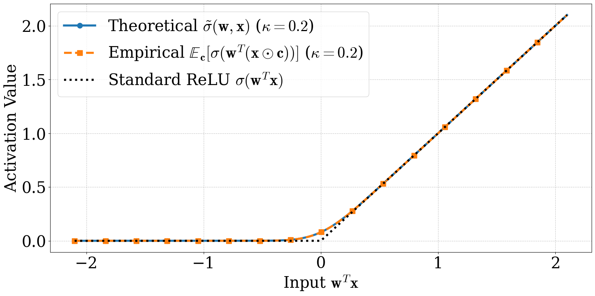
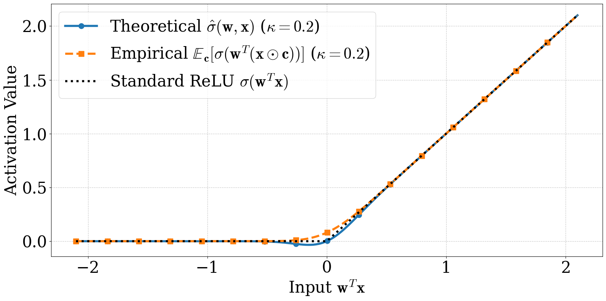
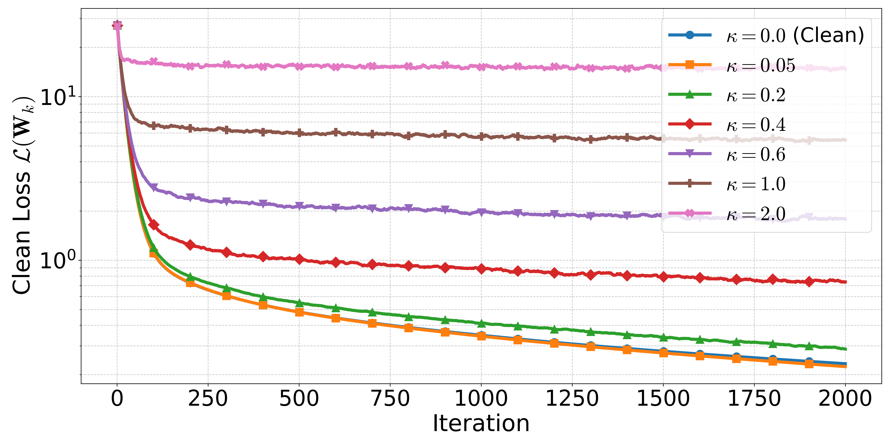
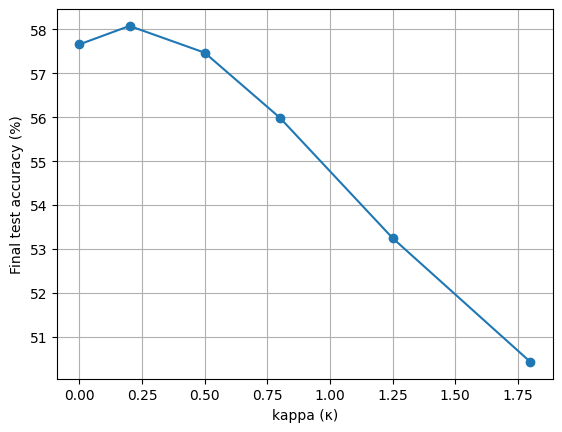
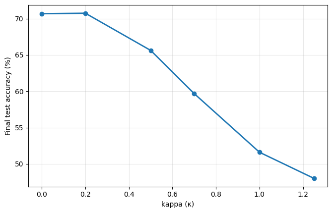
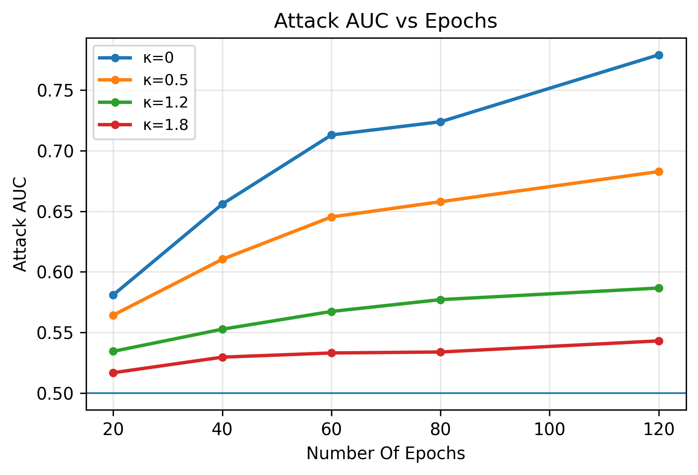
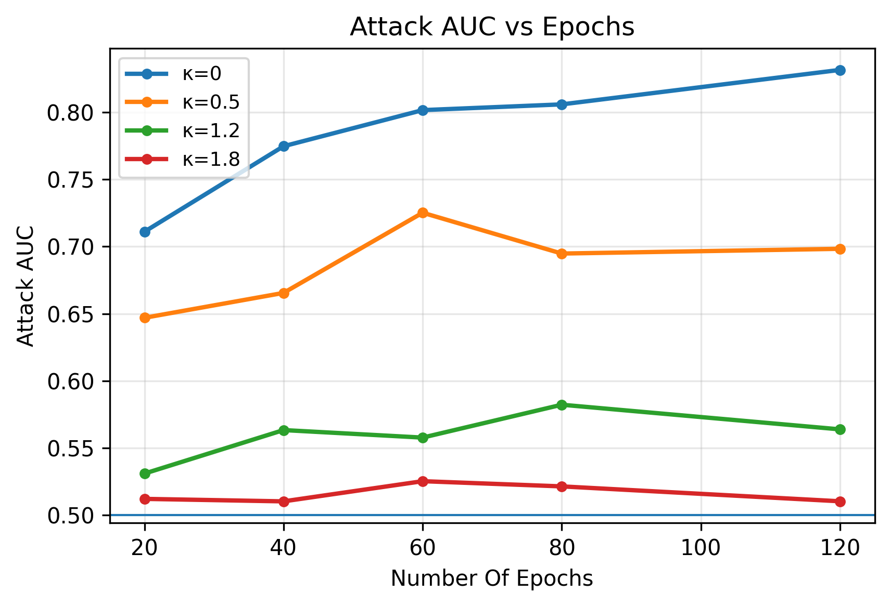

<p align="center">
  <h1 align="center">Multiplicative-Gaussian Input Masking</h1>
  <p align="center">
    <strong>NTK-style convergence theory for two-layer ReLU networks trained under random multiplicative input noise</strong>
  </p>
  <p align="center">
    <a href="https://arxiv.org/abs/2602.17423"></a>
    <a href="#blog"></a>
    <a href="https://www.python.org/"></a>
    <a href="https://pytorch.org/"></a>
    <a href="LICENSE"></a>
  </p>
</p>

---

What happens when every input to a two-layer ReLU network is *multiplied* by an independent Gaussian mask?

$$f(\mathbf{W}, \mathbf{x} \odot \mathbf{c}) = \frac{1}{\sqrt{m}}\sum_{r=1}^{m} a_r\,\sigma\!\big(\mathbf{w}_r^\top(\mathbf{x}\odot\mathbf{c})\big),
\qquad \mathbf{c}\sim\mathcal{N}(\mathbf{1},\kappa^2\mathbf{I}).$$

We give the **first NTK-style convergence proof** for this setting. The key technical move is resolving expectations of a nonlinearity wrapped around a Gaussian-perturbed pre-activation — a problem of independent interest. Out of the analysis falls a *smoothed* ReLU,

$$\hat{\sigma}(\mathbf{w},\mathbf{x})\ =\ \mathbf{w}^\top\mathbf{x}\cdot\Phi\!\Big(\tfrac{\mathbf{w}^\top\mathbf{x}}{\kappa\,\|\mathbf{w}\odot\mathbf{x}\|_2}\Big),$$

a κ-controlled blend between identity and ReLU. With it, the expected loss decomposes cleanly into a smoothed-network MSE plus a data-dependent quadratic regularizer (Theorem 4.1), and SGD on this objective converges **linearly to a κ-controlled error ball** (Theorem 5.5).

<p align="center">
  
  
</p>
<p align="center"><em>The smoothed ReLU emerges from the math. Closed-form expectation (left, exact) and the analyzable proxy used in Theorem 4.1 (right) match Monte Carlo over the input range.</em></p>

<p align="center">
  
</p>
<p align="center"><em>Linear convergence to a κ-controlled error ball. Two-layer ReLU MLP (n=500, d=20, m=100), full-batch GD, lr=0.005, 2000 iterations. Each curve is a different mask variance κ.</em></p>

## ✨ Key Features

- **Closed-form expected loss** decomposing into a smoothed-network MSE plus an adaptive, data-dependent regularizer (Theorem 4.1)
- **Smoothed-ReLU activation** $\hat{\sigma}_\kappa$ — a κ-controlled relaxation between identity and ReLU, with explicit Gaussian-CDF form
- **General SGD framework** for *biased* gradient estimators with a relaxed smoothness condition (Theorem 5.1) — applicable beyond Gaussian masking
- **Explicit convergence guarantee** with linear rate to a noise-controlled error ball whose radius depends constructively on κ, network width m, sample size n, and initialization scale τ (Theorem 5.5)
- **Smoothed-ReLU validator** runs in 30 seconds on a laptop — pure NumPy/SciPy, no GPU
- **Training trajectories** under multiplicative noise for κ ∈ {0, 0.05, 0.2, 0.4, 0.6, 1.0, 2.0}
- **CIFAR-10 illustrations** with multiplicative input noise for MLP and CNN classifiers
- **Distributed-training-over-channels** simulation: FedAvg with multiplicative-Gaussian channel fading
- **Membership-inference attack pipeline** (ML-Leaks framework) with κ-swept defense curves

## 🚀 Quick Start

### Prerequisites

```bash
pip install -r requirements.txt
# numpy, scipy, matplotlib, torch, scikit-learn
```

### Smoothed-ReLU validation — 30 seconds, no GPU

Reproduces the closed-form vs Monte Carlo comparison in Figure 1 of the paper.

```bash
python -m src.smoothed_relu
# → figures/fig01a_smoothed_relu_proxy.{png,pdf}
# → figures/fig01b_smoothed_relu_exact.{png,pdf}
```

### Notebooks (Colab-ready)

| # | Notebook | What it does | Runtime | External deps |
|---|---|---|---|---|
| 01 | `notebooks/01_smoothed_relu.ipynb` | Smoothed ReLU vs Monte Carlo (Fig 1) | <1 min, CPU | none |
| 02 | `notebooks/02_training_trajectories.ipynb` | Loss trajectories at 7 values of κ (Fig 3) | ~5 min, CPU/GPU | preprocessed CIFAR-10 npz |
| 03 | `notebooks/03_classifier_accuracy.ipynb` | MLP & CNN accuracy vs κ (Fig 4) | ~30 min, GPU | `classifier.py`, `mlLeaks.py`* |
| 04 | `notebooks/04_mia_auc_curves.ipynb` | MIA attack AUC vs epochs (Fig 5) | ~1 hr, GPU | `classifier.py`, `mlLeaks.py`* |
| 05 | `notebooks/05_mia_full_pipeline.ipynb` | Per-κ MIA precision/recall/AUC (Figs 6–7) | ~2 hr, GPU | `classifier.py`, `mlLeaks.py`* |

\* See [Status](#-status) for the missing modules.

## 📊 Results

### Convergence to a κ-controlled error ball

<p align="center">
  
</p>

Two-layer ReLU MLP, n=500 synthetic samples, d=20, m=100 hidden units, full-batch GD, lr=0.005, 2000 iterations. Each curve is a different mask variance κ; the y-axis is the *clean* training loss (mask off at evaluation).

| κ | Final $\mathcal{L}(\mathbf{W}_K)$ |
|---|---|
| 0.00 | converges to 0 (clean GD baseline) |
| 0.05 | small error floor |
| 0.20 | error floor visible, still small |
| 0.40 | error floor ∝ κ |
| 0.60 | error floor ∝ κ |
| 1.00 | larger error floor |
| 2.00 | dominant noise regime |

The relationship is **monotone in κ**, validating Theorem 5.5's prediction that the convergence radius scales with the noise standard deviation.

### CIFAR-10 utility under multiplicative noise

<p align="center">
  
  
</p>
<p align="center"><em>Test accuracy versus multiplicative noise strength κ. Left: 1-hidden-layer MLP. Right: 4-conv-layer CNN.</em></p>

1-hidden-layer MLP (4096 units, GELU, dropout 0.2), AdamW + cosine annealing + label smoothing + standard augmentation, 80 epochs:

| κ | Clean test accuracy |
|---|---|
| 0.00 | baseline |
| 0.20 | **slight improvement** (regularization effect) |
| 1.00 | accuracy degrades |
| 1.80 | 49.88% |

CNN with batch-norm + 3 dropouts: maintains ~71% baseline up to κ ≈ 0.2, degrades monotonically thereafter.

### Defense against Membership-Inference Attacks

<p align="center">
  
  
</p>
<p align="center"><em>ML-Leaks attack AUC versus training epochs, swept over κ. Higher AUC = more privacy leakage. Left: MLP target. Right: CNN target.</em></p>

| Epochs | κ=0.0 | κ=0.5 | κ=1.2 | κ=1.8 |
|---|---|---|---|---|
| 20  | 0.578 | 0.563 | 0.538 | 0.522 |
| 40  | 0.670 | 0.611 | 0.550 | 0.522 |
| 60  | 0.720 | 0.646 | 0.567 | 0.541 |
| 80  | 0.716 | 0.664 | 0.573 | 0.533 |
| 100 | 0.702 | 0.678 | 0.581 | 0.537 |
| **120** | **0.782** | **0.692** | **0.585** | **0.543** |

Standard training (κ=0) leaks heavily by epoch 120. Multiplicative-Gaussian training collapses the attack toward chance (0.5) at κ=1.8. *Note: this is empirical privacy, not a formal $(\varepsilon,\delta)$-DP guarantee — see paper §Limitations.*

## 📁 Repository Layout

```
multiplicative-gaussian-input-noise/
├── README.md                          ← you are here
├── LICENSE                            ← MIT
├── requirements.txt
├── notebooks/
│   ├── 01_smoothed_relu.ipynb         ← Fig 1
│   ├── 02_training_trajectories.ipynb ← Fig 3
│   ├── 03_classifier_accuracy.ipynb   ← Fig 4
│   ├── 04_mia_auc_curves.ipynb        ← Fig 5
│   └── 05_mia_full_pipeline.ipynb     ← Figs 6–7
├── src/
│   └── smoothed_relu.py               ← runnable Python entry point for Fig 1
└── figures/                           ← outputs land here; hero figures committed
```

## 🛠 Status

- **Notebooks 03 / 04 / 05** depend on two helper modules (`classifier.py`, `mlLeaks.py`) that are not yet in this repository — they live in the authors' working directory and will be added after a code-review pass. Until then, the data-loading and model-definition cells in those notebooks run independently; the cells that `import` from those modules will raise `ModuleNotFoundError`.
- **Cached data** for Notebook 02 expects pre-processed CIFAR-10 splits under `data/CIFAR10/Preprocessed/{targetTrain,targetTest}.npz`. A small preprocessing script will be added.
- **Figures committed under `figures/`** are the paper's published versions for hero use. Re-running the notebooks/scripts overwrites them with freshly generated copies.

## <a name="paper"></a>📄 Paper

**Convergence Analysis of Two-Layer Neural Networks under Gaussian Input Masking**
Afroditi Kolomvaki · Fangshuo Liao · Evan Dramko · Ziyun Guang · Anastasios Kyrillidis
*Rice University, Department of Computer Science*

[arXiv:2602.17423](https://arxiv.org/abs/2602.17423) · [PDF](https://arxiv.org/pdf/2602.17423v1) · 2026.

## <a name="blog"></a>🔗 Blog post

A reader-friendly walkthrough is forthcoming on the AI-OWLS blog:
*"How a little Gaussian dust changes how a network learns."*

## ✏️ Citation

```bibtex
@article{kolomvaki2026multiplicative,
  title         = {Convergence Analysis of Two-Layer Neural Networks under {G}aussian Input Masking},
  author        = {Kolomvaki, Afroditi and Liao, Fangshuo and Dramko, Evan and Guang, Ziyun and Kyrillidis, Anastasios},
  journal       = {arXiv preprint arXiv:2602.17423},
  year          = {2026},
  eprint        = {2602.17423},
  archivePrefix = {arXiv},
  primaryClass  = {cs.LG},
  url           = {https://arxiv.org/abs/2602.17423}
}
```

## 🙏 Acknowledgements

Rice University CS Department. NSF (CAREER, K2I) and Welch Foundation support.
